# Blogging application - ECE Webtech project

## Introduction

This is a blogging application for Webtech course at ECE Paris. You can read the available articles, log in to write your own articles and share your ideas on current fashion, clothing or trends.
We use the JavaScript runtime Node.js for server-side scripting with the package manager NPM. We create a Next.js application to use React inside. To style our application, we use the Framework TailwindCSS. We use the database supabase available online and deploy our app on Vercel.

## Pre-requisites

- Javascript
- GIT [Git](https://git-scm.com/downloads) 
- NPM package manager
- Next.js
> Install [`npx`](https://www.npmjs.com/package/npx) if it is not yet installed.
- Node.js
>Install Node.js with n-install:
>```
>sudo apt update
>sudo apt install build-essential git curl
>curl -L https://git.io/n-install | bash
>```

## Usage

- Clone this repository, from your local machine :

```bash
git clone https://github.com/Elanore1/ece-webtech-2023-fall-gr04-13.git
```

-   Install all dependencies (use yarn or npm):

```bash
npm install
```

- Run/Build the application :

```bash
#npm run build
npm run dev
```

- Register your GitHub application, get the `clientID` and `clientSecret` from GitHub and report them to your environment variable on Vercel (or on local). Set up 

Vercel env: 
  - GOTRUE_EXTERNAL_GITHUB_CLIENT_ID=
  - GOTRUE_EXTERNAL_GITHUB_SECRET=
  - GOTRUE_EXTERNAL_GITHUB_REDIRECT_URI=

  - NEXT_PUBLIC_SUPABASE_URL=
  - NEXT_PUBLIC_SUPABASE_ANON_KEY=


## Deliverables 

- Vercel URL: https://ece-webtech-2023-fall-gr04-13.vercel.app/
- Supabase project URL: https://vlluwqkedqemqtrxfrte.supabase.co

## Authors

- Elanore LELIEVRE, Gr04-13
- Noe PHAM, Gr04-13
- Solveig BERLING, Gr04-13

## Evaluation

### Mandatory Tasks

## Project management

* **Naming convention**
  * Grade: 2/2
  * Comments: 
  We implement the task by respecting classic naming convention for our projet.
  - Each Components begin with a Capital letter
  - Home page name index.js
  - Using camelCase to name variables, functions, files and folder names
  * Task feedback: 
  This task wasn't very hard. At first we weren't used to it and had to correct certain names several times, but after a while we got the hang of it.

* **Project structure**
  * Grade: 2/2
  * Comments: 
  We respect the repositorie structure for the project.

```txt
/
├── app/          # Frontend (Next.js)
    ├── components/     # Folder for components
    ├── pages/          # Folder for routing pages
    ├── public/         # Folder for images/video
    ├── styles/         #Folder for CSS styles
├── supabase/     # Supabase Docker Compose configuration
    ├── functions/     # Folder for function
    ├── migrations/     # Migrations files
    ├── seed.sql      # db
├── README.md
├── .gitignore
├── .env.example  # Supabase example env
└── README_Images # image for README file
```

  Also, each routing files are in pages/ folder

Our Frontend routing pages :
```txt
  Route (pages)                              Size     First Load JS
┌ λ /                                      3.53 kB         164 kB
├   /_app                                  0 B             110 kB
├ ○ /404                                   708 B           161 kB
├ ○ /about                                 2.22 kB         162 kB
├ ○ /admin/contacts                        2.47 kB         163 kB
├ λ /admin/contacts/[id]                   34.9 kB         195 kB
├ ○ /articles                              1.69 kB         162 kB
├ λ /articles/[id]                         4.16 kB         164 kB
├ ○ /contacts                              3.21 kB         163 kB
├ ○ /hello                                 1.05 kB         161 kB
├ ○ /login                                 22.4 kB         183 kB
├ ○ /profile                               4.09 kB         164 kB
├ ○ /profile/articles                      1.62 kB         162 kB
├ ○ /profile/new-article                   1.82 kB         167 kB
├ ○ /profile/update-article                1.81 kB         167 kB
└ ○ /setting                               2.38 kB         163 kB

λ  (Server)  server-side renders at runtime (uses getInitialProps or getServerSideProps)
○  (Static)  automatically rendered as static HTML (uses no initial props)
```

  * Task feedback: 
  That's not the hardest part. All you need to do is follow the courses to understand how to organize your project.

* **Git usage**
  * Grade: 2/2
  * Comments: 
  We respect the [Conventional Commits](https://www.conventionalcommits.org/en/v1.0.0/), by structuring each commit like this :
```txt  
<type>[optional scope]: <description>

[optional body]

[optional footer(s)]
```
  We rewrote all the commits (squashing redundant ones, rewording when the message didn't respect conventions, etc.).
  * Task feedback: 
  When you're not familiar with github, it's very difficult, and we've almost lost our project several times during merges and the like. It was only by practicing that we managed to understand better (especially rebase, which seemed a bit complicated).

* **Code quality**
  * Grade: 3.5/4
  * Comments: 
  We've designed our code to be readable and understandable at a glance. Maybe we could have put a bit more commentary in the code so that people could better understand what we're doing. 
  * Task feedback: 
  We prefer to indent our code directly to know when to close a parenthesis, for example. It wasn't a very hard task, you just have to remember to comment to explain to others what such and such a piece of code is used for.

* **Design, UX, and content**
  * Grade: 3.5/4
  * Comments: 
  We use Tailwind based component librairies like Tailwind UI, Flowbite, Headless UI. We wanted to create a responsive app that was easy for the user to use. 
  * Task feedback: 
  We'd never used tailwind CSS before, so it wasn't the easiest thing to do. But then we realized that it was even simpler, and by using examples we were able to create a very beautiful application.

## Application development
* **Home page**
  * Grade: 2/2
  * Comments: 
  The source code of the welcome page is in [index.js](/pages/index.js)
  Our home page displays a short video next to a generated quote.
  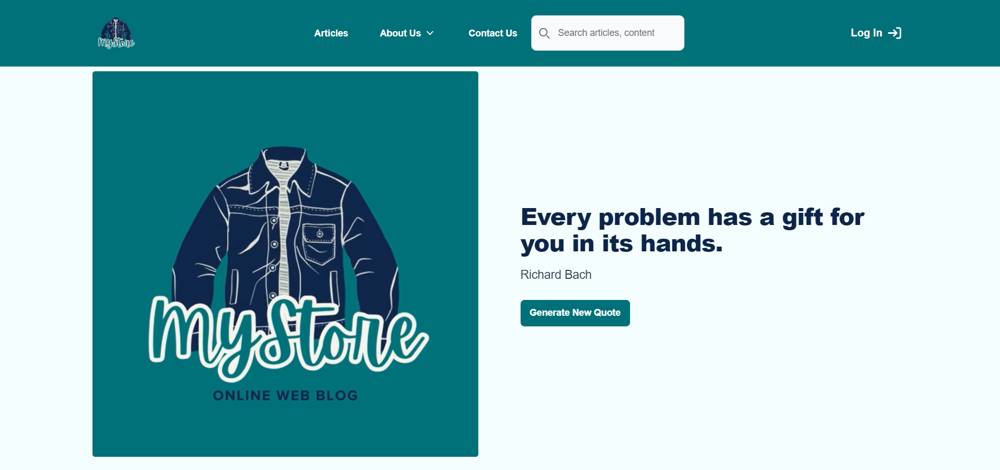

  Then we have CTAs for the Articles page, the About us page and the Contact us page. 
  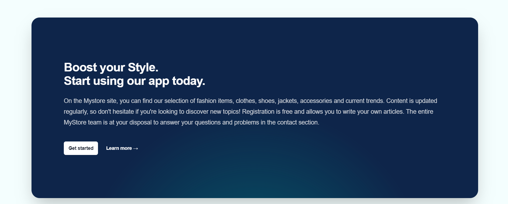

  Last but not least, we have a NEWS section with the latest articles, with a CTA leading to each article page. 
  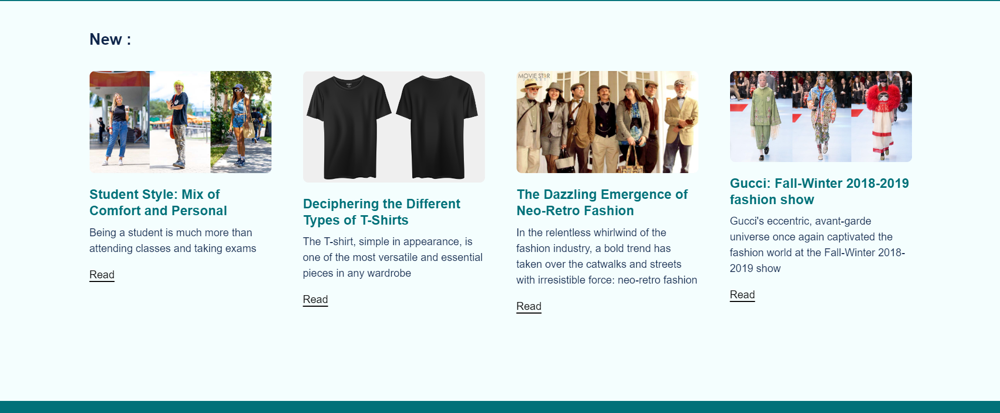

  It was super interesting to design the page, we took examples from Tailwind css to make an intuitive home page that makes you want to visit.It was super interesting to design the page, we took examples from Tailwind css to make an intuitive home page that makes you want to visit.
  * Task feedback: 
  The task isn't very difficult: you can shape your page and do whatever you like. The only goal is to make users want to continue browsing. 
    - To improve : 
    We could add more features on the home page

* **Navigation**
  * Grade: 2/2
  * Comments: 
  We create a navbar in our Header.js components. 
  The source code of the Header component is in [Header.js](/components/Header.js)
  

  We create a Layout component to be shared between all pages. It contains our Header and Footer component.
```javascript
export default function Layout({ children, title, description}){
  return (
    <>
      <Head>
        <title>{title}</title>
        <meta name="description" content={description} />
        <link rel="icon" href="/favicon.ico" />
      </Head>
      <div className ="p-0 space-y-12 bg-whiteSpecial">
        <Header/>
        <main className ="min-h-screen p-16 md:p-16 lg:p-16 bg-whiteSpecial">
          {children}
        </main>
        <Footer />
      </div>
    </>
  )
}
```
  * Task feedback: 
  This part was carried out during our labs throughout the semester, so we were able to follow the instructions, adapting the style to what we were looking for. It's great to learn how to use the different components in our application.
  - To improve : 
    We can add a disclosure under the Article button with each tag to be redirect only on the article taged ('mode','trend','parade',etc.)

* **Login and profile page**
  * Grade: 4/4
  * Comments: 
  We create to components (LoggedIn.js and LoggedOut.js) that we implement in our Header. If the user is set, the LoggedIn component display the user information (username/email/avatarImage), in the other case, the LoggedOut component display a button Login to redirect to .

  The source code of the LoggedOut component is in [LoggedOut.js](/components/LoggedOut.js)
  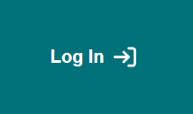

  The source code of the LoggedIn component is in [LoggedIn.js](/components/LoggedIn.js)
  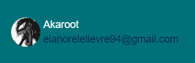

```javascript
<div className="hidden lg:flex lg:flex-1 lg:justify-end">
  {user ? (
    <div className="flex items-center space-x-4">
      <Popover className="relative">
        <LoggedIn />
      </Popover>
    </div>    
  ) : (
    <div>
      <LoggedOut /> 
    </div>
  )}
</div>
```
  The Login button redirect to the login page where we can Sign In/ Sign Up with a Github Provider using Auth component of Supabase.
  The source code of the login page is in [login.js](/pages/login.js)
  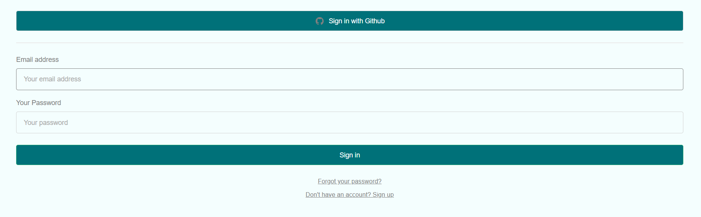

  The Auth component of Supabase let us specify 'github' as providers. We have to set the ClientId, Client Secret and Callback URL for Oauth in our supabase project (online) our in our .env file.

```javascript
<Auth supabaseClient={supabaseClient} appearance={{
  style: {
      button: { background: '#007179', color: 'white' },
  },
  theme: ThemeSupa
  }} 
  providers={['github']}
  redirectTo ={getURL()} 
/>
```
  On SignIn/SignUp, we redirect the user to he's profile page. This page show the public information/personnal information of the user registered in supabase. 
  The source code of the login page is in [profile.js](/pages/profile.js)
  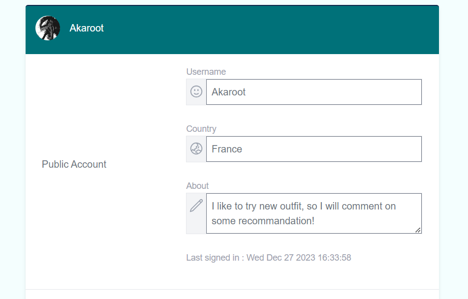
  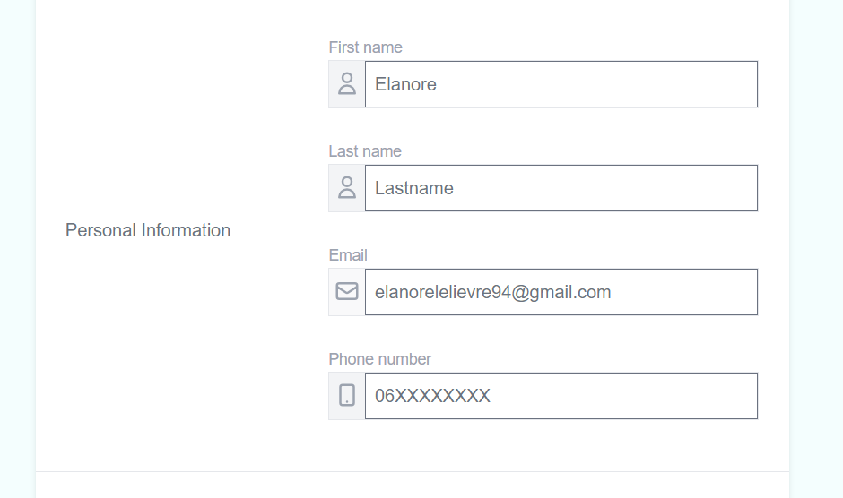
  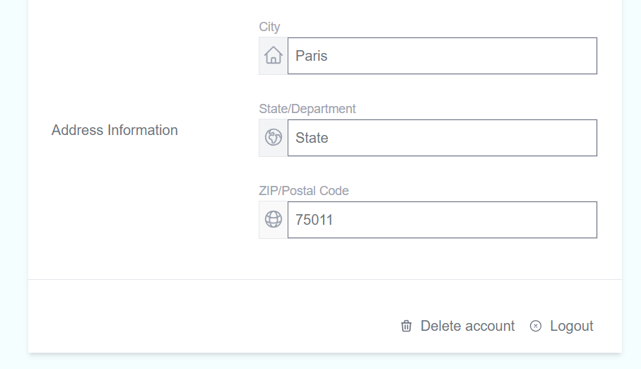

  The user can choose to delete all the information registered by clicking on the delete button at the end of the page. 
  * Task feedback: 
  This task was a bit difficult, we have to set all the environment variable great to make it work. 
  - To improve : 
    Add new provider (google,facebook,etc.) 

* **Post creation and display**
  * Grade: 6/6
  * Comments: 
  The creation of post is only available for authenticated users. When a user is logged in, he can found 'My Article' button to see the article that he wrote and to add a new one by cliking on Add an Article.
  The source code of the articles page for user is in [profile/articles.js](/pages/profile/articles.js)
  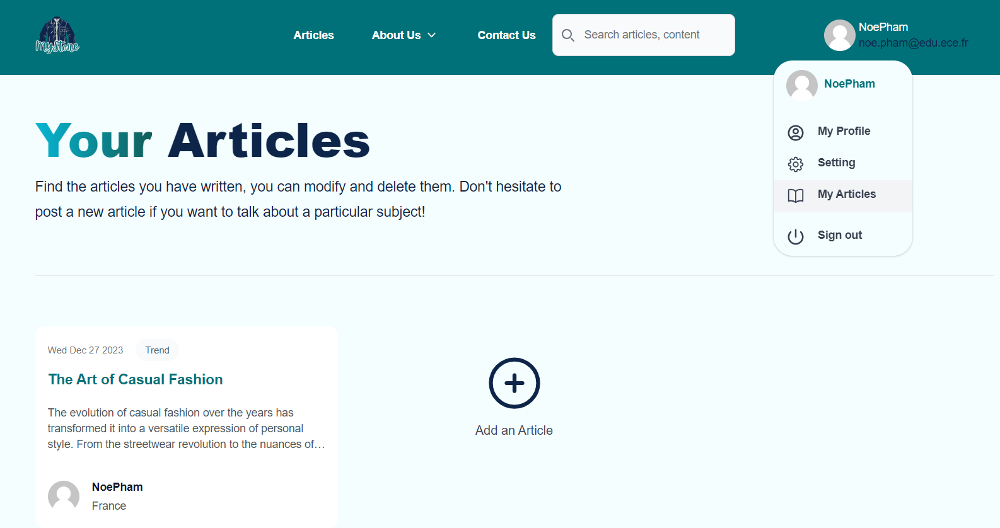

  The source code of the new-article page for user is in [profile/new-article.js](/pages/profile/new-article.js)
  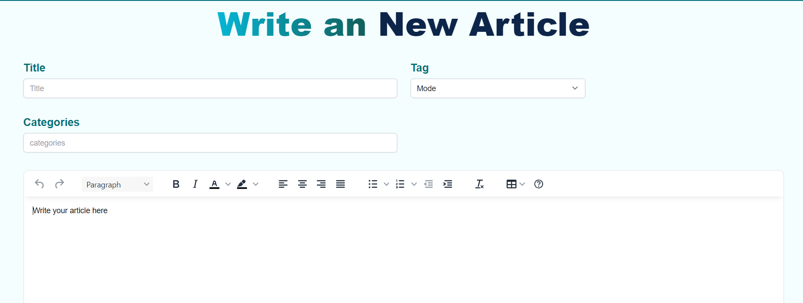
  
  We use a FormData to collect the information and onSubmit we insert a new article in our Supabase database.

```javascript 
  const handleSubmit = async (e) => {
      e.preventDefault()
      console.log(formData)
      console.log(articleContent)
      if(articleContent){
          const {data, error} = await supabaseClient
          .from('articles')
          .insert([{
              title: formData.title,
              tag: formData.tag,
              categories: formData.categories,
              content: articleContent,
              user_id: user.id
          },])
          .select()
          if(error){
              console.log(error)
          }
          router.push('/profile/articles')
      }else{
          console.log("Pas de contenu")
      }
  }
```
  The list of articles is display in the articles page and available for public user. 
  The source code of the article page is in [articles.js](/pages/articles.js)
  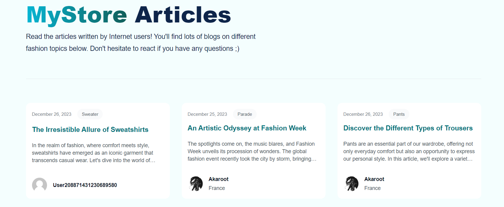

  To display the article and the user that wrote it, we select all information from articles (ascending date) and profiles table of our database, and we map the articles to find the profil Associated with the 'user_id' of the articles table.

```javascript
(async () => {
  let { data : articles, error } = await supabaseClient.from('articles').select(`*`).order('created_at', { ascending: true })
  let { data : profiles, error2 } = await supabaseClient.from('profiles').select(`*`)
  setDatas(bothTable(articles,profiles))
})()

const bothTable = (articles, profiles) => {
  const CryptoJS = require("crypto-js")
  const datas = articles.map((article) => {
    const profileAssocie = profiles.find((profile) => profile.id === article.user_id)
      return { ...article, profile: profileAssocie , GravatarUrl: `https://www.gravatar.com/avatar/${CryptoJS.MD5(profileAssocie?.email.toLowerCase()).toString()}?d=mp`}
  })
  return datas
}
```

  Each article can be seen in a dedicated page based on the id of the article.
  The source code of the articles/[id] page is in [[id].js](/pages/articles/[id].js)
  We use getServerSideProps() to retrieve the id of the article that we want to display.

```javascript
export async function getServerSideProps(context) {
  return {
    props: {
        id: context.params.id
    },
  }
}
```
  We can see the article content display on the page, we also have the comment post and at the end a section Related Artcile showing the article with the same tag then the one we are actually looking at. 

  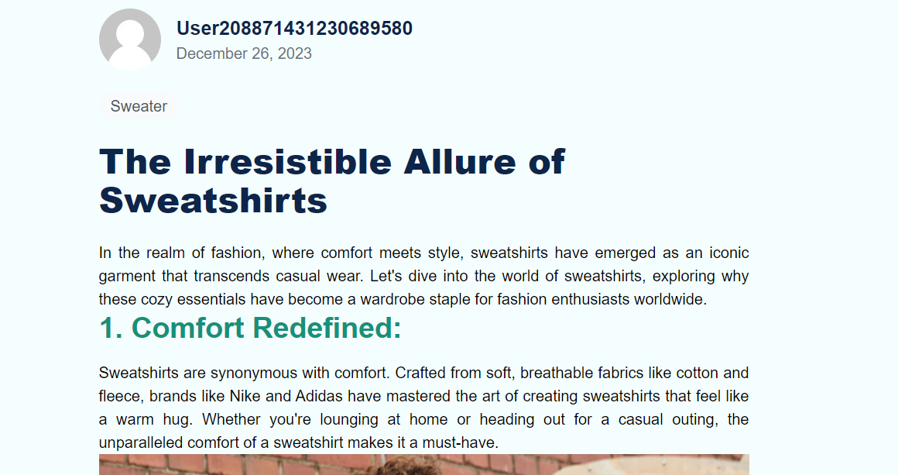
  
  * Task feedback: 
  At the beginning we had some problems with the policy management, it took us some time but we managed to do what we wanted.
  - To improve : 
    In the related Articles list we could add a search by tag AND/OR categories
    We could implemente a respond list that can slide, here we just show the first 4 articles related
    Add the About section of the Author in the section at top of the article

* **Comment creation and display**
  * Grade: 3.5/4
  * Comments: 
  We create a comments table in our Database that get the user id and the article id. We implement it so only authentificate users can add a comment. 

  The source code of the comment page is in [[id].js](/pages/articles/[id].js)

  We get all comments from this article and look in the profiles table wich users post it.

```javascript
let { data : comments, error1 } = await supabaseClient.from('comments').select(`*`).eq(`article_id`, id)
let { data : profiles, error2} = await supabaseClient.from('profiles').select(`*`)
const comment = commentTable( comments,profiles)

const commentTable = (comments, profiles) => {
    const commentsWithProfiles = comments.map((comment)=>{
        const profileAssocie = profiles.find((profile) => profile.id === comment.user_id)
                    return { ...comment, profile: profileAssocie, isGood: false, isBad: false}
    })
    return commentsWithProfiles
}
```
  Beside the Post a comment form, we can see comments from the other users.

  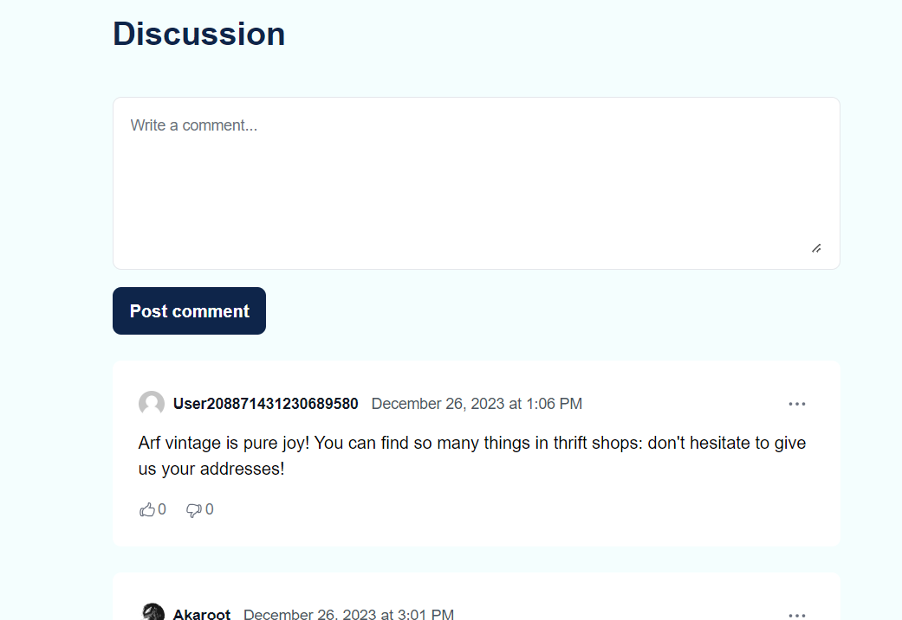

  * Task feedback: 
  It wasn't very hard, but we've simplified the task a little by allowing only authenticated users to post comments. 
  - To improve : 
    Allow anon users to comment,
    Add the possibility to replied to a selected comment
    Add the possibility to delete a comment

* **Post modification and removal**
  * Grade: 4/4
  * Comments: 
  When the author id match the user id, the [[id].js](/pages/articles/[id].js) page change a bit. We have two button before the article to delete or remove the article.

  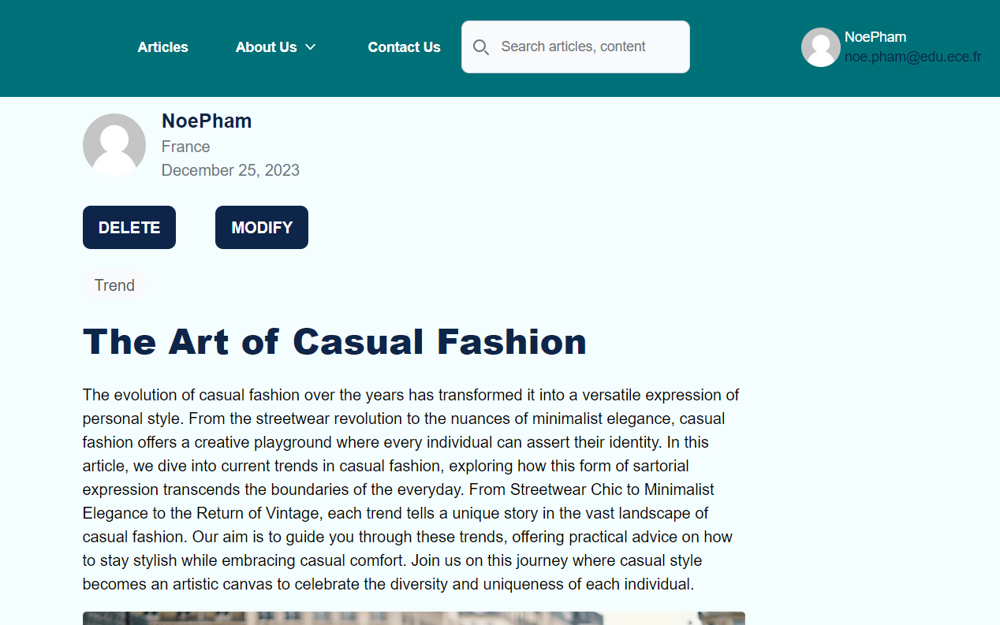

  To do that, we have a boolean isUserAuthorized that update if the user id is the same then user_id from the artcile.

```javascript
{isUserAuthorized && (
<>
    <div className="mt-6">
        <button type="button" id='delete' onClick={handleDeleteArticle} className="...">
            DELETE
        </button> 
        <button type="button" id='modify' onClick={handleUpdateArticle} className="...">
            MODIFY
        </button> 
    </div>
</>
)}
```
  The DELETE button activate the handleDeleteArticle function, while the MODIFY button activate the handleUpdateArticle. The first function is simple, we just have to create a new policie with the right to delete if id is the same. The second one leads to `/profile/update-article` page, where we can modify an article. 

```javascript
const handleDeleteArticle = async (e) => {
    let { data, error} = await supabaseClient
    .from('articles')
    .delete()
    .eq('id', id)
    router.push(`/articles`)
}
const handleUpdateArticle = (e) => {
    router.push({
        pathname: `/profile/update-article`,
        query: { id: data?.id },
    })
}
```
  The source code of the update-article page is in [update-article.js](/pages/profile/update-article.js)
  We search the data of the article in the Supabase database and write them on the form. The user can change the value and save or cancel the action and no change will appeard. 

  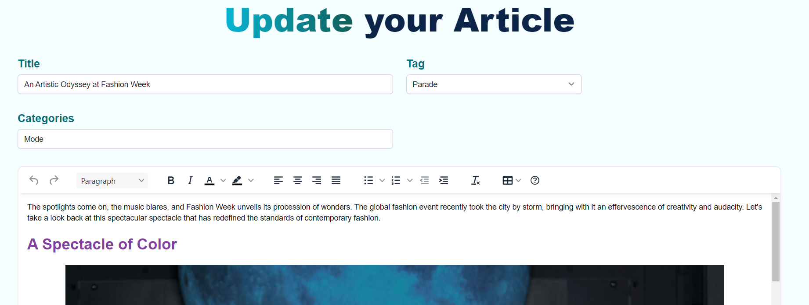

  * Task feedback: 
  This task wasn't really the hardest, as we already had our layout, and to create an article, we just had to change the article id by switching pages. 
  - To improve : 
    Sometimes the text content doesn't render exactly how we write it (especially the Heading), so we can improve this
    Add an admin role that can delete any articles

* **Search**
  * Grade: 5.5/6
  * Comments: 
  We also create a SearchBar accessible in the Header. For that, we use the Full Text Search capabilities of Supabase. The first thing to do is to create a new colomn in the articles table of type tsvector that generated always like this :

```javascript
-- adding fts for search in articles
alter table
  articles
add column
  fts tsvector generated always as (to_tsvector('english', title || ' ' || tag || ' ' || categories || ' ' || content)) stored;

create index articles_fts on articles using gin(fts); -- generate the index
```
  This enables a full-text search on the attributes of our articles, with the most relevant results first, and all very efficiently. When the user write something, he goes to the page `/articles?search=${formData.search}` where we can see what he wrote inside the search bar. In our articles.js page, when search exist, we select from our database with ".textSearch('fts', searchValue)", to get only articles refering on this textSearch.

```javascript
//Header.js
//when writting on the searchBar 
const handleSearch = async (e) => {
  e.preventDefault()
  console.log(formData.search)
  if(formData.search.length === 0)
    router.push(`/articles`)
  else
    router.push(`/articles?search=${formData.search}`)
}

//articles.js
if(search){
      (async () => {
        console.log(createSearchString())
        //use the fts column to search
        const { data : articles, error } = await supabaseClient.from('articles').select().textSearch('fts', `${createSearchString()}`)
        console.log("articles for search :", articles)
        let { data : profiles, error2 } = await supabaseClient.from('profiles').select(`*`)
        console.log(profiles)
        setDatas(bothTable(articles, profiles))
        console.log("DATAS",datas)
      })()

    }
```

  * Task feedback: 
  It was a tough job, as we'd never done it before. We had to go to the supabase website to find out how textsearch works and how to create a tsvector.
  - To improve : 
  Add the user in the search, when writting a username our search doesn't show the articles written by the specified user.

* **Use an external API**
  * Grade: 2/2
  * Comments: 
  We choose to implement an external API in our home page [index.js](/pages/index.js), to generate a random quote each time we click on the button. We use the API quotable.io that has a large database of quotes whit their author. For us it was the best way to implement this because these are positive quotes.

```javascript
let fetchNewQuote = () => {
  fetch("http://api.quotable.io/random")
    .then(res => res.json())
    .then(
      (quote) => {
        setQuote(quote.content)
        setAuthor(quote.author)
      }
    )
}
```

  * Task feedback:
  It was easy enough to use an external API as we had learned to do in class. It adds relevance to our website
  - To improve : 
  Add another external API for generate random image if the article doesn't have any image. 

* **Resource access control**
  * Grade: 4.5/6
  * Comments: Our Application is secure by default. We have different policies on each tables to control the data.
  Our articles table as 4 policies. The first two one is to allow user to delete/update an article if they are authenticated and the user_id is the same. We also allow user to insert if they are authenticated and allow the select for public. 

```text
articles Policies:

DELETE
Enable delete for users based on user_id
Applied to:authenticated

UPDATE
Enable update for users based on user_id
Applied to:authenticated

INSERT
Enable insert for authenticated users only
Applied to:authenticated

SELECT
Enable read access for all users
Applied to: public
```
  Our comments table allows authenticated to update and insert comment, but every one can read the comment (Select)
```text
comments Policies:

UPDATE
Enable update for marks
Applied to:authenticated

INSERT
Enable insert for authenticated users only
Applied to: authenticated

SELECT
Enable read access for all users
Applied to: public
```
  We also have policies on contacts table so that only authenticated can see the content from the contact us page but all people can insert in the contact page. 
  To finish we have the profiles table that contains the information of each auth.users. Profiles can be seen by everyone, and all users authenticated can insert or modify or delete their own profile. 
  
  * Task feedback: 
  We've tried to make our application as secure as possible, but we've had some problems with the various policies.

* **Account settings**
  * Grade: 4/4
  * Comments: 
  We create a dashboard for the user to modify his personnal setting. For that we create a new table profiles that is created in cascade when new user sign in. We choose to create a profile information with username, firstname, lastname, about (sentence about the user), phone country, department, city & postal code. You can also change you profile image (but the image is not save in our database).

  The source code of the setting page is in [setting.js](/pages/setting.js)

  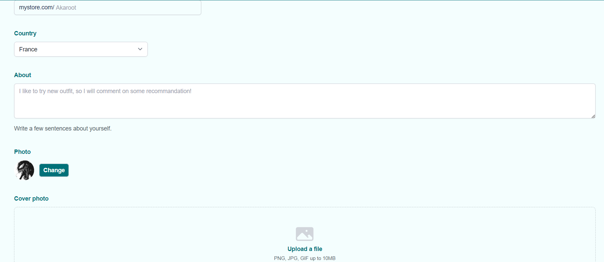

  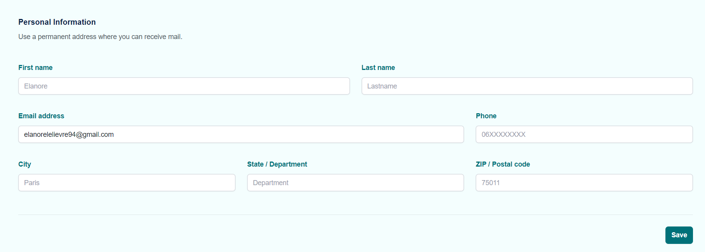

  When he click on 'Save', every data is update inside the user profile data. 

  * Task feedback: 
  I think it's nice to simply suggest that you try out different things in a form to modify the information, but it's still better to actually save the information, especially with the tasks you've had to do beforehand.
  - To improve : 
  see how to save images directly in Supabase, not to use only gravatar but make it possible to add an profile image and save it.

* **WYSIWYG integration**
  * Grade: 2/2
  * Comments: 
  To implement WYSIWYG in our project, we use the [TinyMCE](https://www.tiny.cloud) librairy that provide an 'Editor' component, very easy to implement, with plenty of options, such as adding color, identation, font size, highlighting, bold, italic, backspace, etc.

```javascript 
  <Editor
      apiKey='no-api-key'
      onInit={(evt, editor) => editorRef.current = editor}
      name="content" id="content"
      initialValue="<p>Write your article here</p>"
      init={{
      height: 800,
      menubar: false,
      plugins: [
      'a11ychecker','advlist','advcode','advtable','autolink','checklist','export',
      'lists','link','image','charmap','preview','anchor','searchreplace','visualblocks',
      'powerpaste','fullscreen','formatpainter','insertdatetime','media','table','help','wordcount','textcolor'
      ],
      toolbar: 'undo redo | casechange blocks | bold italic forecolor backcolor | ' +
      'alignleft aligncenter alignright alignjustify | ' +
      'bullist numlist checklist outdent indent | removeformat | a11ycheck code table help',
      content_style: 'body { font-family:Helvetica,Arial,sans-serif; font-size:14px }'
      }}
      onChange={handleEditorChange}
  />
```

  * Task feedback: 
  It was really easy because the library provided everything: all we had to do to display the articles was translate the html we'd get from this text zone. 
  - To improve :
  Maybe add mor tools on the Editor to have more possibility of style.

* **Gravatar integration**
  * Grade: 2/2
  * Comments: 
  To diplay a Gravatar user icon, I created a profile on gravatar to personalize my picture. Gravatar is an image that is associated with our email address. When we connect on a site that use Gravatar with this email address, our profile picture will be the one we choose on gravatar. Gravatar uses a hashed version (MD5) of the e-mail address to generate a unique identifier. We use crypto-js in our code to convert the md5hash of the email address and after, we construct our gravatar URL. At the end, we precise '?d=mp' to display an empty profile icon if the user hasn't got a Gravatar image.

  How we construct our Gravatar URL :
```javascript
   //Gravatar URL
    const CryptoJS = require("crypto-js")
    const lowercaseEmail = user.email.toLowerCase()
    const md5Hash = CryptoJS.MD5(lowercaseEmail).toString()
    const gravatarUrl = `https://www.gravatar.com/avatar/${md5Hash}?d=mp`
```
  * Task feedback: 
  It was really interesting to discover this, we hadn't heard of it before. However, it's not necessarily the most relevant. I would have liked to use the github images, for example.

* **Light/dark mode**
  * Grade: 0.75/2
  * Comments: 
  We implement the dark theme in our code for some pages/components, using the dark class from tailwind.css that is active when darkmode is active. But, except that we didn't code something to make the changement from light to dark mode, we doesn't have the time to do it. 

```javascript 
  <span className="text-white sm:text-center dark:text-gray-400 dark:text-gray-700">© 2023 Powered by <Link href="https://github.com/Elanore1/ece-webtech-2023-fall-gr04-13" className="hover:underline">ECE-Webtech-gr04-13</Link></span>
```

  * Task feedback: 
  Maybe we should talk about this at the beginning of the tps, so we can take the time to really make a beautiful dark mode.
  - To improve : 
  create a button in setting to activate/desactivate darkmode

### Bonus Tasks

* ***Saving Profile***   
  * Grade: 2
  * Comments: 
  When the user is on the setting screen, we choose to save the information inside his profile. For that, we use .update() where 'id' equal to the id of the user. One problem is that id the user already save some information, we have to take them and print them (in the placeholder) so that he can change or let them like this. 

  Our handleSubmit() function where we update the data of the user depending on the value on he's formData element :

```javascript 
const handleSubmit = async (e) => {
  e.preventDefault()
  //update
  const {data, error} = await supabaseClient
  .from('profiles')
  .update( {
      username: formData.username ?  formData.username : usernameInput.current.placeholder,
      about: formData.about ?  formData.about : aboutInput.current.placeholder !== 'Write something about you' ? aboutInput.current.placeholder : null,
      first_name: formData.first_name ?  formData.first_name : first_nameInput.current.placeholder !== 'Firstname' ? first_nameInput.current.placeholder : null,
      last_name: formData.last_name ?  formData.last_name : last_nameInput.current.placeholder !== 'Lastname' ? last_nameInput.current.placeholder : null,
      phone: formData.phone ?  formData.phone : phoneInput.current.placeholder !== '06XXXXXXXX' ? phoneInput.current.placeholder : null,
      country: formData.country ? formData.country : countryInput.current.value,
      city: formData.city ?  formData.city : cityInput.current.placeholder !== 'City' ? cityInput.current.placeholder : null,
      department: formData.state ?  formData.state : stateInput.current.placeholder !== 'Department' ? stateInput.current.placeholder : null,
      postal_code: formData.postal_code ?  formData.postal_code : postal_codeInput.current.placeholder !== 'Postal code' ? postal_codeInput.current.placeholder : null,
      email: user?.email,
  }).eq(`id`, user.id)
  if(error){
      console.log(error)
  }
  router.push('/profile')
}
```

* ***Likes/Dislikes on comment***   
  * Grade: 2
  * Comments: 
  We want choose to implement like and dislike on comments. All users, authenticated or not can like or dislike the comment of a user. The 'like' or 'dislike' appears in blue when we select it, and if we change our mind, we can select the other one.

  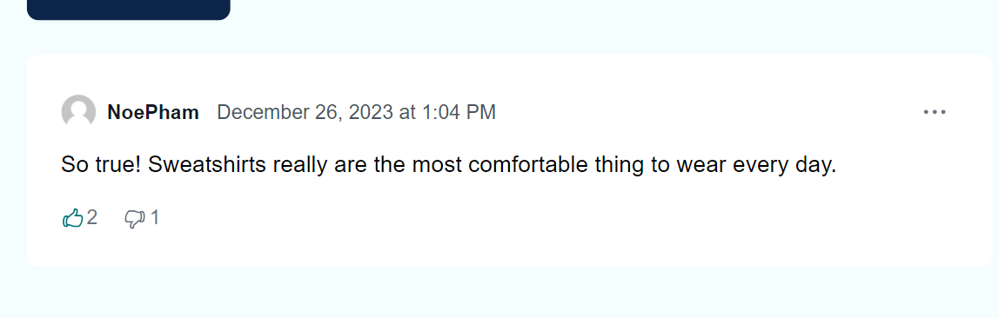

## Miscellaneous

### Course Feedback

The course was very interesting. We learned a lot about Next.js, Supabase and Node.js. I think the fact that we had to hand in our advanced Labs every week was great because it forced us to get straight to work. However, sometimes we had a lab that was really extremely full where we had to do/discover a lot while some were really short (less than 30 min of work alone). We might need to readjust the long ones by putting more on the short ones, to balance the work better. It was very useful to have a correction repository, because when we really had a problem we could draw on it. In conclusion, it was really a great subject to discover and we're happy with the end result. We'll have to think about updating it for next year, depending on the various Next.js updates.

Thank you very much!

### Project Reuse

- We authorize the professors to use our project as an example for the next year students.